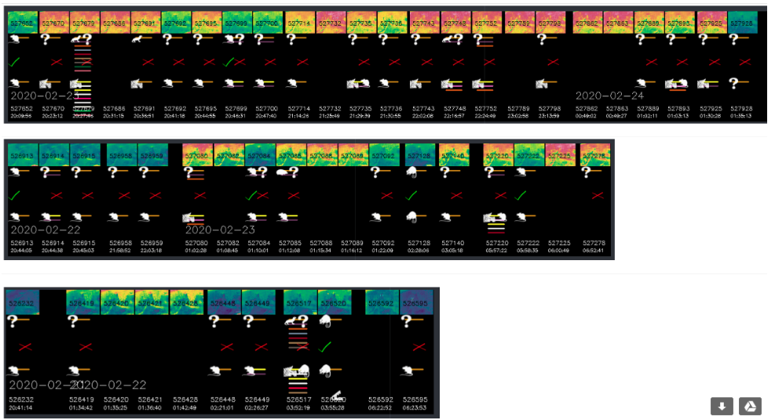
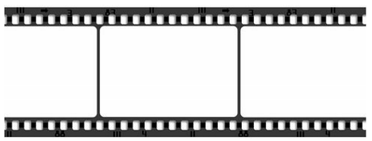
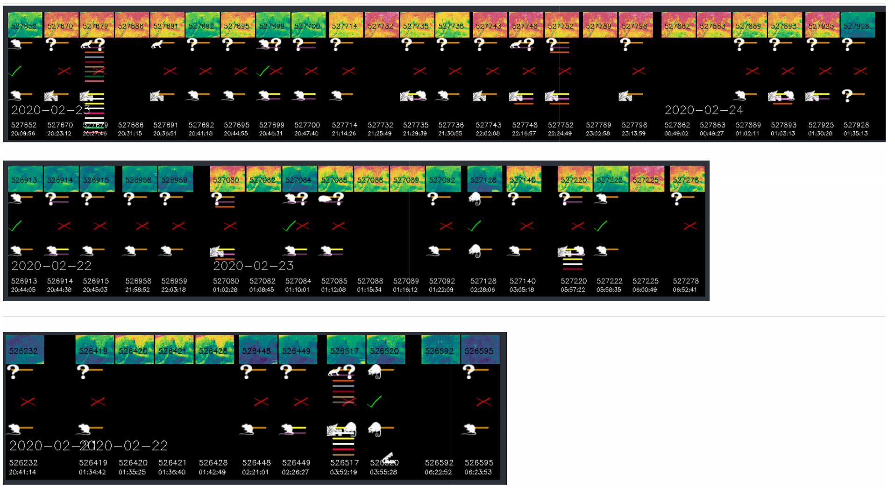
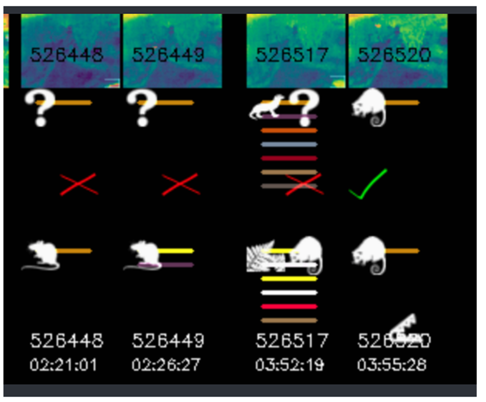
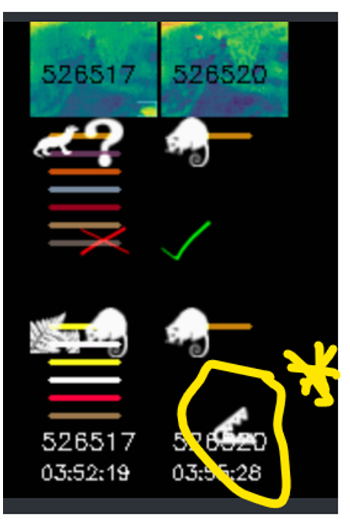

# Update 20W11 on IDEA, TrackVisualizer.

Thoughts around this Visualizer (Dashboard) were first presented in [IDEA-20W04-TrackVisualizer](.%5CIDEA-20W04-TrackVisualizer.md)

Subsequent to this a  python coded model has expanded as idea's surfaced and the tool has become more frequently used by the author. @auphofBSF

Various discussions on use or purpose of  the visualizations has been happening and a request for the definition of the Use Cases been generated, this document "**Update 20W11 on IDEA, TrackVisualizer"** attempts to capture and document  artifacts of design  for further discussion.
 
### Current example of the Track Visualization as at writing

## Use Cases

### Overview

The Uses cases are about presenting recordings of tracked species in a long time duration format.
A suggested way of achieveing this in a visually condensed format is the use of the Filmstrip format, with Argumented tracks below the film strip , some being overlays
A visually condensed format must be presented in a useful manner  for Human based pattern recognition but also flexible to enable different users needs.
The uses cases below are all written from the perspective of a Trap Coordinator for want of a better term. This person is doing analytics on trap position and effectiveness.

#### Notes

The general  mission  of this tools and systems used is the targeted elimination of pest animal species. There are however potential overlap of these Use cases into other possible missions, they will not be explored in this document.

The Cacophony visit Analysis, report in the Cacophony Browser  is an important report to look at and summarize recordings and as such provides a history.
However to further perform further analytical analysis, one must  observe various details sometimes in combinations  over  longer durations of time, such as  over a night, or multiple nights or weeks.
Presentation of Observations details in recordings cover aspects of the visits such as counts, species, track detail, confidence of classification or other system metrics of camera/platform operation such as battery state, exceptions, themal background.

I believe this long duration visual presentation tool  is an important part of refining the visit Analysis and ultimately the visit reduction if that is what the mission is.

| # | Use Case | How | IMAGES |
| --- | -------- | --- | ------ |
| 1 | The Trap co-ordinator wants to observe patterms over long time durations and be able to interact (for further event or classification annotation ) with recordings of animals passing through a camera's field of view.  This Usecase solution must enable the observer to do see  data patterns to enable human pattern discovery and hopefullysome recognition or ideas to aid in improving systems to which the mission the camera recordings are being dedicated . | Display thumbnails for a nights recording in a timestrip with relative spacing. Display previous nights recordings as rows beneath each other.   The thumbnails are ideally  zoomed in frames on the longest duration track showingthe target being tracked. It is possible in a multiple track recording that thethumbnails from each track are displayed consecutively in the overall timeline or are an in an animated gif format, cycling through representative frames of each track. The thumbnails are annotated with additional data, in consistent but distingushing formats to enable pattern observation. THis annotation may be overlay over film strip frames, or annotation tracks in parallel to the film strip that present data, under each frame.  These film strip annotation tracks can also have overlay elements.  Data elements can be displayed in icons, lines, or AlphaNumeric values, consideration being  given to color , density, conflict, consistency |   |
| 2 | The Trap Co-ordinator is trying to observe the automatic classification that the current recognition model is achieving, all in the time domain as per use case 1 | The space beneath the  filmstrip frames is used as Annotation Tracks. The annotation tracks indicate  process results or metrics. Group similar processs as am Annotation Tracks  beneath the filmstrip frames.  Annotation Tracks  can also overlay each other. ie 1st track is icons representing the determined or undetermined species. Underlaying this is colored lines indicating number of classification the classifier determined |  |
| 3 | The Trap Co-ordinator is trying to observe the success rate of the automatic classifier | Add an additional  Annotation Track on which the  human classified species is drawn with an overlay  indicator describing the success or exception of  thematch between human and AI classification | as per above |
| 4 | Allow the Trap Co-ordinator to Navigate to recordings for the point of further classification or annotation | Each thumbnail is a hotspot taking you to the recording and human classifierinterface |  |
| 5 | Allow the Trap Co-ordinator to observe additional tags/events that have occurred | as in example a trap interaction icon is displayed |  |
| 6 | Allow the Trap Co-ordinator to observeother aspects of the themal camera operation. 1\. Is the camera in an optimum location from a thermal background perspective 2\. Overlays of camera operational metrics\, ie Battery state\, FFC corrections\, sound lure activations | Thezoomed out icons in the filmstrip can be chosen as those that represent theaverage background condition. this then can demonstrate how that background ischanging over night and week. It can also demonstrate if there are cameraalgorithim issues.   Byoverlaying on thumbnails or annotation tracks, battery state and other camera metrics or sound lure information avisual pattern can be gleaned by an operator. |  |
|  |  |  |  |

