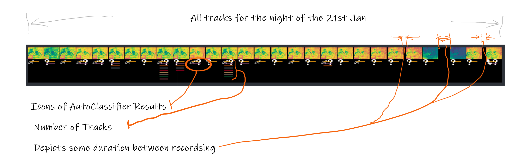
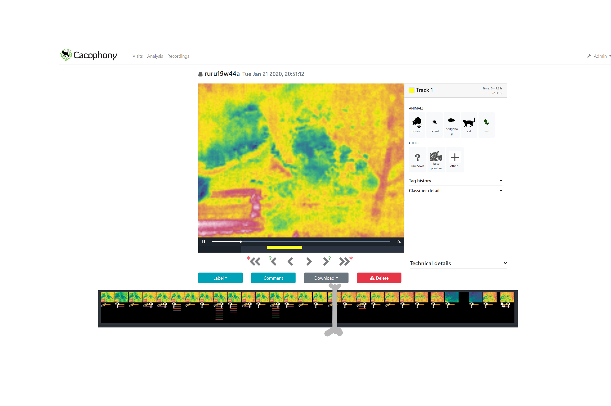

# IDEA,  track timeline view, a possible extension for Cacophony Browser,

---

## Desired

> a graphical single screen view of all tracks from a nights observation.

## Key Points
A frame represents an individual recording with tracks, the frame ideally is representative of the recording, This frame is a full image scaled. perhaps because of the scaling (in this case 10%) it could be a zoomed in view of the bounding box of the first tracked artifact.
Blank space between frames demonstrates some time interval between recordings

Track information is displayed below the frame. What I am attempting to view is how many tracks and what auto classifications has been done. I can also show what human classification has been done and how much agreement there is between auto and human.

## Further Applications
This visualizer could also form a more sophisticated transport control below in the cacophony browser, an indexed slider overlaying this image enabling rapid navigation to a recording of interest. a crude mock up is shown

## Implementation notes

Python code exists to construct this visualizer, I run it in an adhoc Notebook and would need making more robust. However this can be used for ideas fleshing out.

Further actions:
20W04 23/1 Publish to Cacophony developers for input and feedback

TODO: cleanup and upload python code

---

