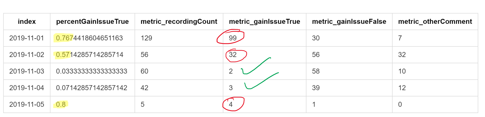
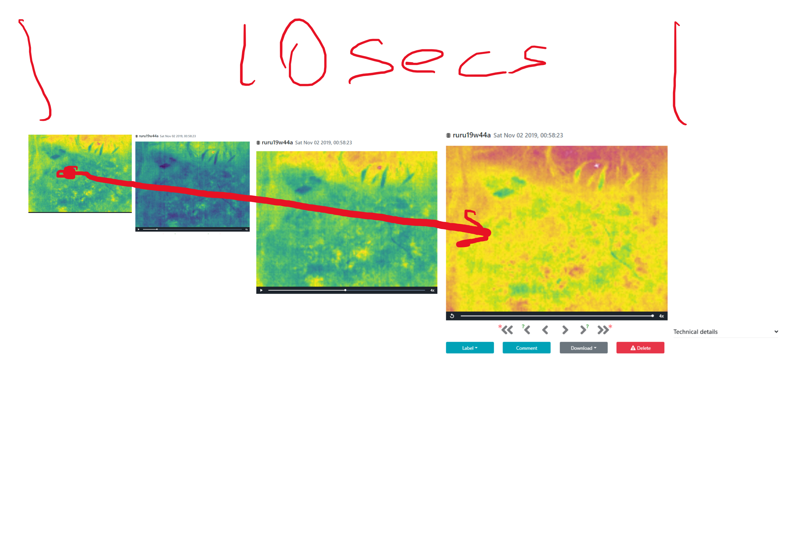
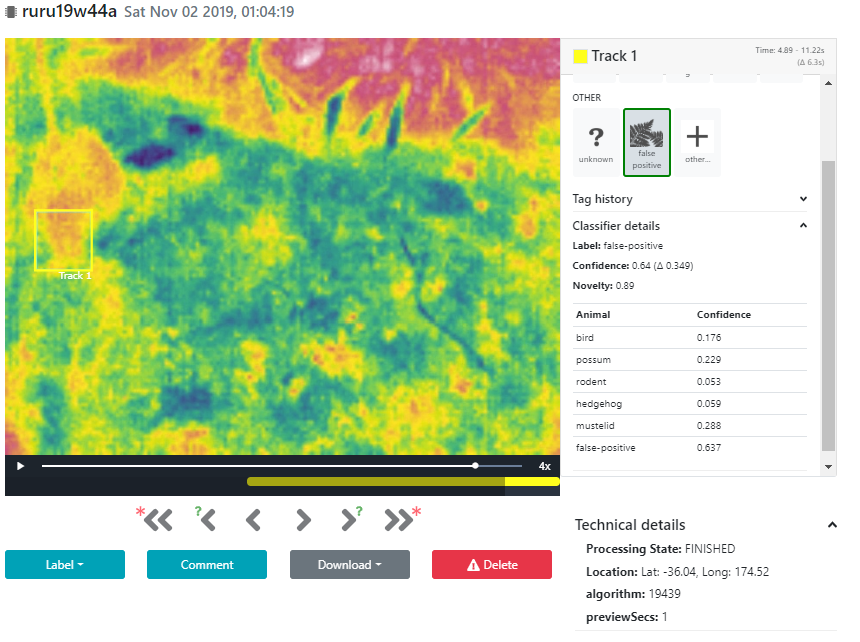
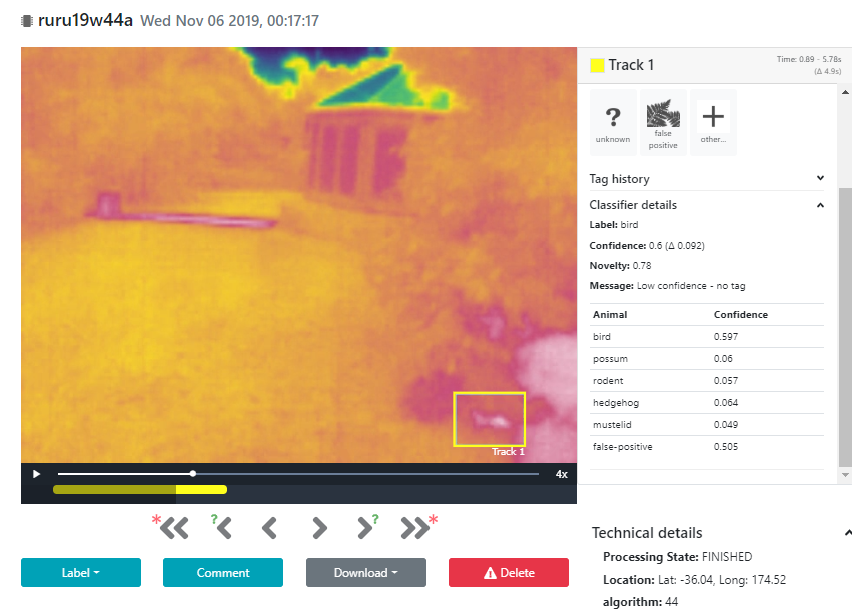

# Analysis of observations in 19W45
### Issue of incorrect image GAIN or AGC issues possibly related to FFC

There is a variance in the recording qualtiy  that would appear to be related to AGC and FFC affecting the gain

Interestingly the camera never changed position for night of 2nd Nov yet only 57% of recordings had issues

for night of 3 the camera was repositioned to show less of the flax and the incidence of GAIN/AGC issues was reduced. Camera remained in position for night of 11/4

for Night of 11/5 the camera was deployed to a new site where rodent activity was expected. Warm building and brick foot path seem to be affecting GAIN/AGC?

Period beieg observerd is 2019-11-01 onwards
and results to Night of 5th Nov just gone

The images have manually been annotated for "Gain Issue" by manual commenting in the browser.

Detailed lists of images with gain issues are saved to these files with links
[recordingAnalysis2019-11-01-Gainissues](recordingAnalysis2019-11-01-Gainissues.md)
[recordingAnalysis2019-11-02-Gainissues](recordingAnalysis2019-11-02-Gainissues.md)
[recordingAnalysis2019-11-03-Gainissues](recordingAnalysis2019-11-03-Gainissues.md)
[recordingAnalysis2019-11-04-Gainissues](recordingAnalysis2019-11-04-Gainissues.md)
[recordingAnalysis2019-11-05-Gainissues](recordingAnalysis2019-11-05-Gainissues.md)
These have been compiled using datat from the CacophonyAPI

### The summary of comment annotations looking specifically at Gain/AGC 

[RecordingAnalysisSummary2019-11-01 to 2019-11-05.md](RecordingAnalysisSummary2019-11-01&#32;to&#32;2019-11-05.md)

###Example Night 11/01
The following shows <https://browse.cacophony.org.nz/recording/414526> where gain changed throughout recording

another example <https://browse.cacophony.org.nz/recording/414529>

###Example Night 11/05
The following was typical of all recordings example shown <https://browse.cacophony.org.nz/recording/418168>

